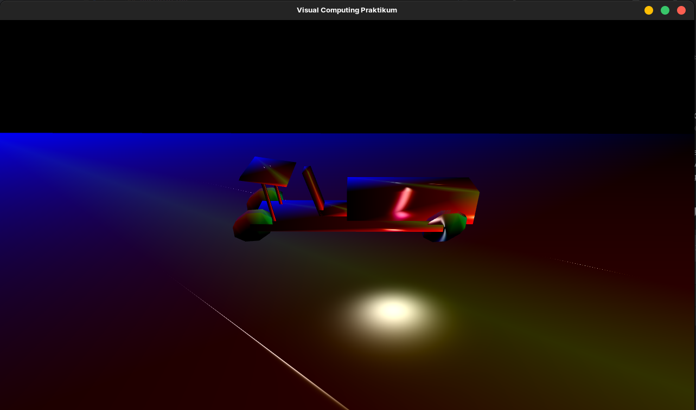

# Graphic Processing Project

## Description
C++ implementation of a simple graphic 3-dimensional scene using OpenGL 
graphics API.



## Purpose
- prove the use of Vertex Buffer Object (VBO), Vertex Array Object (VAO) and 
Index Buffer Object (IBO) by loading simple objects (e.g.
[a cube](./src/Game/Cube_normals.h) - cube with normals on each vertex) 
on computer's graphic board.
- implement simple transformations for the scene graph (Scale, Translate, Rotate)
- control the camera: movements, increase/decrease of FOV (field of view), rotate around a point.
- implement Phong's Illuminating Model and Phong' Shading Model

## Modules
- `assets` -> `shaders` - here is to be mentioned the presence of [Vertex-](./assets/shaders/vertex.glsl) and [Fragment](./assets/shaders/fragment.glsl) Shaders
> Please note: The used IDE is CLion from JetBrains. To load any modification made
> to shaders follow these steps:
> 1. Menu
> 2. Tools
> 3. CMake
> 4. Reload CMake Project
- `Aufgaben` - PDF Files containing Tasks that were to be implemented (german only)
- `framework` - different files that manage OpenGL Errors, Keyboard Input, Window and also an Object Loader 
(for more complex objects, i.e. `.obj` files)
- `libs` - library necessary for OpenGL
- `Media` - contains one picture of the program execution
- `src` - in `Scene.cpp` all the magic happens

## Commands
The project in its current state doesn't provide the user an interface to change keys, having only 
predefined controls. These are the following: 

    For controlling the light source position:
    - Arrow Up-Down: move light source on Y axis
    - Arrow Left-Right: move light source on X axis
    - Key::Comma and Key::Period: move light source on Z axis (depth axis)

    For starting the animation (start-stop the car, it should go to the right):
    - Key::L

    For controlling the camera position:
    - Key::A and Key::D : move camera on X axis
    - Key::W and Key::S : move camera on Y axis
    - Key::Q and Key::E : move camera on Z axis (depth axis)

    For rotating the camera around the center point (0,0,0):
    - Key::LeftShift + Mouse movement

    For controlling the FOV (Field of View):
    - MouseScroll_Up : increasing
    - MouseScroll_Down : decreasing
## First time setup - Linux Debian/Ubuntu
> ```commandline
> Could NOT find X11 (missing: X11_X11_INCLUDE_PATH X11_X11_LIB)
> ```
> can be solved with the following command in terminal:
> ```commandline
> sudo apt install libx11-dev
> ```

> ```commandline
>   CMake Error at libs/glfw-3.2.1/CMakeLists.txt:222 (message):
> The RandR library and headers were not found
> ```
> can be solved with the following command in terminal:
> ```commandline
> sudo apt install libxrandr-dev
> ```

> ```commandline
>   CMake Error at libs/glfw-3.2.1/CMakeLists.txt:231 (message):
> The Xinerama library and headers were not found
> ```
> can be solved with the following command in terminal:
> ```commandline
> sudo apt install libxinerama-dev
> ```

> ```commandline
>   CMake Error at libs/glfw-3.2.1/CMakeLists.txt:262 (message):
> The Xcursor libraries and headers were not found
> ```
> can be solved with the following command in terminal:
> ```commandline
> sudo apt install libxcursor-dev
> ```

> ```commandline
> CMake Error at /snap/clion/261/bin/cmake/linux/x64/share/cmake-3.27/Modules/FindPackageHandleStandardArgs.cmake:230 (message):
>   Could NOT find OpenGL (missing: OPENGL_opengl_LIBRARY OPENGL_glx_LIBRARY
>   OPENGL_INCLUDE_DIR)
> ```
> can be solved with the following command in terminal:
> ```commandline
> sudo apt install libgl1-mesa-dev
> ```

> ```commandline
> fatal error: GL/glu.h: No such file or directory
> 1205 | #    include <GL/glu.h>
>      |              ^~~~~~~~~~
> ```
> can be solved with the following command in terminal:
> ```commandline
> sudo apt install libglu1-mesa-dev
> ```

Now everything works as expected!

## Special Thanks
The project was done under the coordination of Prof. Bjorn Frömmer of
Hochschule Darmstadt of Applied Sciences, Germany.